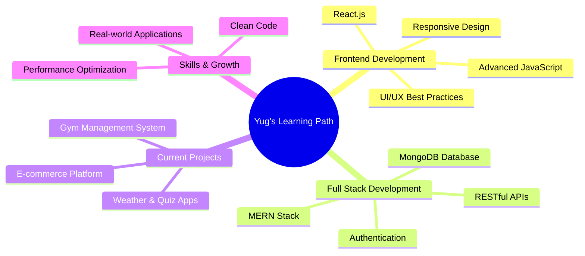

<div align="center">

<!-- Animated Wave Header -->


<!-- Animated Typing Effect -->
<a href="https://git.io/typing-svg">
  
</a>

<!-- Profile Views Counter -->
<p>
  
</p>

</div>

---

## 🎯 About Me

```javascript
const yug = {
    role: "Full Stack Web Developer",
    currentlyLearning: "MERN Stack Development",
    code: ["HTML5", "CSS3", "JavaScript", "React", "Node.js", "MongoDB"],
    passion: ["UI Design", "Full Stack Apps", "Real-world Solutions"],
    currentProject: "Gym Management System (MERN Stack)",
    completedProjects: ["E-commerce Site", "Todo App", "Weather App", "Quiz App"],
    philosophy: "Learning by building, one project at a time",
    funFact: "Great UI isn't just design — it's how it feels to use ✨"
};
```

<div align="center">

### 🚀 Quick Highlights

</div>

<div align="center">

| 💻 Full Stack Developer | 🎨 UI Designer | 📚 MERN Stack Learner | 🔨 Project Builder |
|:---:|:---:|:---:|:---:|
| Clean Code | Beautiful Interfaces | MongoDB + Express | Real Applications |

</div>

---

## 🌐 Connect With Me

<div align="center">

[](https://www.linkedin.com/in/yug-sharma-aab0b9323/)
[](https://github.com/yug-void-dev)
[](https://github.com/yug-void-dev)

</div>

---

## 🛠️ Tech Stack & Tools

<div align="center">

### Frontend Technologies


### Backend & Database


### Tools & Platforms


</div>

---

## 🎨 Featured Projects

<div align="center">

### 🌟 Live Projects & Applications

<table>
<tr>
<td width="50%">

<h3 align="center">🛒 E-Commerce Website</h3>
<div align="center">
<a href="https://github.com/yug-void-dev/ecommerce-web-site" target="_blank">

</a>
<br/>


<br><br>
<p>Full-featured e-commerce platform with product catalog, shopping cart functionality, and modern responsive design</p>
<a href="https://github.com/yug-void-dev/ecommerce-web-site">

</a>
</div>

</td>
<td width="50%">

<h3 align="center">✅ React Todo App</h3>
<div align="center">
<a href="https://github.com/yug-void-dev/todo-app" target="_blank">

</a>
<br/>


<br><br>
<p>Fully functional Todo App with add, edit, delete features and persistent localStorage support for saving tasks</p>
<a href="https://github.com/yug-void-dev/todo-app">

</a>
</div>

</td>
</tr>

<tr>
<td width="50%">

<h3 align="center">🌤️ Weather App</h3>
<div align="center">


<br><br>
<p>Real-time weather application with API integration, location search, and dynamic weather display</p>
</div>

</td>
<td width="50%">

<h3 align="center">🎯 Quiz App</h3>
<div align="center">


<br><br>
<p>Interactive quiz application with score tracking, timer functionality, and instant feedback system</p>
</div>

</td>
</tr>

<tr>
<td width="50%">

<h3 align="center">💼 Internship Projects</h3>
<div align="center">
<a href="https://github.com/yug-void-dev/internship-projects" target="_blank">

</a>
<br/>


<br><br>
<p>Collection of projects completed during Frontend Internship at Unified Mentor</p>
<a href="https://github.com/yug-void-dev/internship-projects">

</a>
</div>

</td>
<td width="50%">

<h3 align="center">💪 Gym Management System</h3>
<div align="center">

<br/>


<br><br>
<p>Full-stack MERN application for gym management with member tracking, subscriptions, and admin dashboard</p>

</div>

</td>
</tr>
</table>

> **🎯 Project Philosophy:** Building real-world applications with focus on clean code, responsive design, and exceptional user experience

</div>

---

## 📊 GitHub Statistics

<div align="center">


</div>

---

## 🎯 Current Focus

<div align="center">



</div>

---

## 🏆 Achievements & Milestones

<div align="center">


</div>

---

## 💡 Philosophy

<div align="center">

> ### *"Great UI isn't just design — it's how it feels to use."* ✨


</div>

---

## 📈 Contribution Graph

<div align="center">


</div>

---

## 🎵 Coding Playlist

<div align="center">

[](https://open.spotify.com/user/spotify)

</div>

---

## 📫 Get In Touch

<div align="center">

### Let's build something amazing together! 🚀

<p>
  <a href="mailto:your.email@example.com">
    
  </a>
  <a href="https://www.linkedin.com/in/yug-sharma-aab0b9323/">
    
  </a>
  <a href="https://github.com/yug-void-dev">
    
  </a>
</p>

### 💬 "Open to collaborations, freelance projects, and interesting opportunities!"

</div>

---

<div align="center">

### ⭐ Don't forget to star my repositories if you find them interesting!


**Thank you for visiting my profile! Happy Coding! 👨‍💻✨**


</div>
