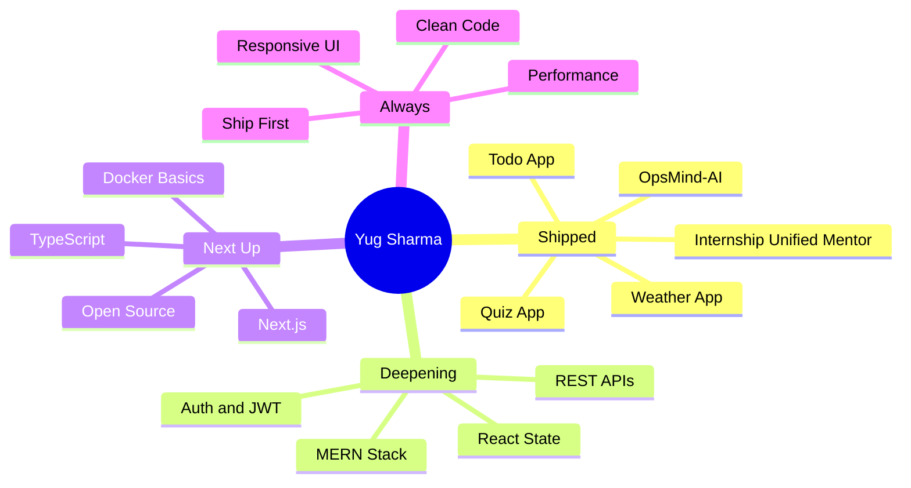

<div align="center">

<!-- ULTRA ANIMATED HEADER -->


<br/>

<!-- ANIMATED TYPING SVG -->
<a href="https://git.io/typing-svg">
  
</a>

<br/>

<!-- BADGES ROW -->
<p>
  
  &nbsp;
  
  &nbsp;
  
</p>


</div>

---

##  `whoami`

```typescript
const yug: FullStackDeveloper = {
  name        : "Yug Sharma",
  title       : "Full Stack Web Developer",
  location    : "India 🇮🇳",
  learning    : "MERN Stack — going deeper every single day",
  stack       : {
    frontend  : ["HTML5", "CSS3", "JavaScript", "React.js"],
    backend   : ["Node.js", "Express.js", "MongoDB"],
    tools     : ["Git", "GitHub", "VS Code", "Postman"],
  },
  shipped     : ["OpsMind-AI 🤖", "Weather App 🌤️", "Quiz App 🎯", "Todo App ✅"],
  profiles    : {
    github    : "https://github.com/yug-void-dev",
    linkedin  : "https://linkedin.com/in/yug-sharma-aab0b9323",
    leetcode  : "https://leetcode.com/u/7nDpsgSkh2",
  },
  philosophy  : "Ship it. Polish it. Repeat. 🔁",
  funFact     : "Great UI is not just design — it is how it *feels* ✨",
};
```

<div align="center">

| ⚡ Full Stack Dev | 🎨 UI Craftsman | 🤖 AI Builder | 🧠 Problem Solver |
|:---:|:---:|:---:|:---:|
| MERN Stack | Pixel-perfect Interfaces | OpsMind-AI | LeetCode Grinder |

</div>


---

##  Connect With Me

<div align="center">

<a href="https://www.linkedin.com/in/yug-sharma-aab0b9323/">
  
</a>
&nbsp;
<a href="https://github.com/yug-void-dev">
  
</a>
&nbsp;
<a href="https://leetcode.com/u/7nDpsgSkh2/">
  
</a>

<br/><br/>


</div>


---

## 🛠️ Tech Stack & Arsenal

<div align="center">

### ⚡ Frontend


### 🔧 Backend & Database


### 🧰 Tools & Platforms


<br/>


&nbsp;

&nbsp;

&nbsp;

&nbsp;

&nbsp;

&nbsp;

&nbsp;


</div>


---

## 🚀 Shipped Projects — 100% Complete ✅

<div align="center">

</div>

<table>
<tr>
<td width="50%" valign="top">

<h3 align="center">🤖 OpsMind-AI</h3>
<div align="center">


<br/>


<br/><br/>
<p>AI-powered operations assistant — intelligent responses, clean conversational UI, and real-world utility built end-to-end</p>

<a href="https://github.com/yug-void-dev/opsmind-ai">
  
</a>

</div>
</td>
<td width="50%" valign="top">

<h3 align="center">🌤️ Weather App</h3>
<div align="center">


<br/>


<br/><br/>
<p>Real-time weather with live OpenWeather API, city search, dynamic condition icons & fully responsive layout</p>

<a href="https://github.com/yug-void-dev/weather-app">
  
</a>

</div>
</td>
</tr>

<tr>
<td width="50%" valign="top">

<h3 align="center">✅ React Todo App</h3>
<div align="center">


<br/>


<br/><br/>
<p>Full-featured task manager — add, edit, delete, toggle complete & persists data across sessions via localStorage</p>

<a href="https://github.com/yug-void-dev/todo-app">
  
</a>

</div>
</td>
<td width="50%" valign="top">

<h3 align="center">🎯 Quiz App</h3>
<div align="center">


<br/>


<br/><br/>
<p>Interactive timed quiz — countdown timer, live score tracking, instant answer feedback & smooth animated transitions</p>

<a href="https://github.com/yug-void-dev/quiz-app">
  
</a>

</div>
</td>
</tr>

<tr>
<td width="50%" valign="top">

<h3 align="center">💼 Internship Projects</h3>
<div align="center">


<br/>


<br/>


<br/><br/>
<p>Curated collection of frontend projects built and delivered during my internship at Unified Mentor</p>

<a href="https://github.com/yug-void-dev/internship-projects">
  
</a>

</div>
</td>
<td width="50%" valign="top">

<h3 align="center">🔭 More Dropping Soon</h3>
<div align="center">


<br/><br/>


<br/><br/>
<p>New full-stack MERN projects in active development. Star the profile to get notified when they land!</p>

<a href="https://github.com/yug-void-dev?tab=repositories">
  
</a>

</div>
</td>
</tr>
</table>

> 💡 **Heads up:** If any repo link shows 404, the repo may be private or named slightly differently. Visit **[github.com/yug-void-dev](https://github.com/yug-void-dev)** to browse all public repositories directly.


---

## 📊 GitHub Analytics

<div align="center">


<br/>


</div>


---

## 🏆 GitHub Trophies

<div align="center">


</div>


---

## 🎯 Dev Roadmap

<div align="center">


```mermaid
mindmap
  root((Yug Sharma))
    Shipped
      OpsMind-AI
      Weather App
      Quiz App
      Todo App
      Internship Unified Mentor
    Deepening
      MERN Stack
      REST APIs
      Auth and JWT
      React State
    Next Up
      TypeScript
      Next.js
      Open Source
      Docker Basics
    Always
      Clean Code
      Ship First
      Responsive UI
      Performance
```

</div>


---

## 📈 Contribution Graph

<div align="center">


</div>


---

## 🐍 Watch the Snake Eat My Commits

<div align="center">

<picture>
  <source media="(prefers-color-scheme: dark)" srcset="https://raw.githubusercontent.com/platane/snk/output/github-contribution-grid-snake-dark.svg"/>
  <source media="(prefers-color-scheme: light)" srcset="https://raw.githubusercontent.com/platane/snk/output/github-contribution-grid-snake.svg"/>
  
</picture>

</div>


---

## 💡 Dev Philosophy

<div align="center">

<br/>

> ### *"Great UI isn't just design — it's how it **feels** to use."* ✨
> ### *"Ship it. Then make it perfect. Done beats perfect every time."* 🚀

<br/>


<br/>


</div>


---

## 📫 Let's Build Something Amazing

<div align="center">

### 🤝 Open to collaborations, freelance & exciting opportunities!

<br/>

<a href="mailto:your.email@example.com">
  
</a>
&nbsp;
<a href="https://www.linkedin.com/in/yug-sharma-aab0b9323/">
  
</a>
&nbsp;
<a href="https://leetcode.com/u/7nDpsgSkh2/">
  
</a>
&nbsp;
<a href="https://github.com/yug-void-dev">
  
</a>

<br/><br/>


<br/><br/>

### ⭐ Star my repos if you find them useful — it truly means a lot!

</div>

---

<div align="center">

**Thanks for stopping by! Keep building, keep shipping. 👨‍💻✨**


</div>
