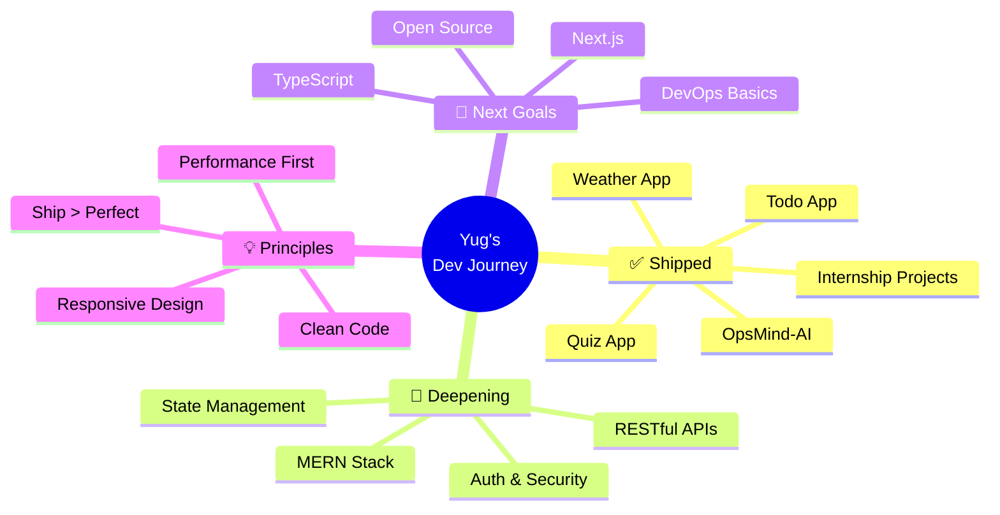

<div align="center">

<!-- Animated Header -->


<!-- Animated Typing -->
<a href="https://git.io/typing-svg">
  
</a>

<br/>

<!-- Profile Views + Follow -->
<p>
  
  &nbsp;
  
</p>

</div>

---


##  About Me

```typescript
const yug: Developer = {
  name        : "Yug Sharma",
  title       : "Full Stack Web Developer",
  location    : "India 🇮🇳",
  learning    : "MERN Stack — diving deeper every day",
  stack       : ["HTML5", "CSS3", "JavaScript", "React", "Node.js", "Express", "MongoDB"],
  interests   : ["Clean UI", "Real-world Apps", "Open Source"],
  completedProjects : ["OpsMind-AI", "Weather App", "Quiz App", "Todo App"],
  currentFocus: "Sharpening full-stack skills & contributing to OSS",
  philosophy  : "Learning by building — one project at a time 🔨",
  funFact     : "Great UI isn't just design — it's how it *feels* to use ✨",
};
```

<div align="center">

| 🚀 Full Stack Dev | 🎨 UI Craftsman | 🤖 AI Explorer | 📚 Lifelong Learner |
|:---:|:---:|:---:|:---:|
| MERN Stack | Pixel-perfect UI | OpsMind-AI Builder | Daily commits |

</div>

---


##  Connect With Me

<div align="center">

[](https://www.linkedin.com/in/yug-sharma-aab0b9323/)
[](https://github.com/yug-void-dev)
[](https://leetcode.com/u/7nDpsgSkh2/)
[](https://github.com/yug-void-dev)


</div>

---


## 🛠️ Tech Stack & Arsenal

<div align="center">

### ⚡ Frontend
<p>
  
</p>

### 🔧 Backend & Database
<p>
  
</p>

### 🧰 Tools & Platforms
<p>
  
</p>

<br/>

<!-- Animated tech icons row -->


</div>

---


## 🚀 Completed Projects

> All projects below are **100% shipped and live** ✅

<div align="center">

<table>
<tr>
<td width="50%" valign="top">

<h3 align="center">🤖 OpsMind-AI</h3>
<div align="center">


<br><br>
<p>An AI-powered operations assistant — intelligent responses, clean UI, and real-world utility built with modern web tech</p>

<a href="https://github.com/yug-void-dev">
  
</a>

</div>
</td>
<td width="50%" valign="top">

<h3 align="center">🌤️ Weather App</h3>
<div align="center">


<br><br>
<p>Real-time weather with live API integration, city search, dynamic condition icons, and clean responsive UI</p>

<a href="https://github.com/yug-void-dev">
  
</a>

</div>
</td>
</tr>

<tr>
<td width="50%" valign="top">

<h3 align="center">✅ React Todo App</h3>
<div align="center">


<br><br>
<p>Full-featured task manager with add, edit, delete, completion toggle & localStorage persistence — no data lost on refresh</p>

<a href="https://github.com/yug-void-dev/todo-app">
  
</a>

</div>
</td>
<td width="50%" valign="top">

<h3 align="center">🎯 Quiz App</h3>
<div align="center">


<br><br>
<p>Interactive quiz with countdown timer, live score tracking, instant answer feedback, and smooth animated transitions</p>

<a href="https://github.com/yug-void-dev">
  
</a>

</div>
</td>
</tr>

<tr>
<td width="50%" valign="top">

<h3 align="center">💼 Internship Projects</h3>
<div align="center">


<br><br>
<p>A curated collection of frontend projects built and delivered during my internship at Unified Mentor</p>

<a href="https://github.com/yug-void-dev/internship-projects">
  
</a>

</div>
</td>
<td width="50%" valign="top">

<h3 align="center">🌟 More Coming Soon</h3>
<div align="center">


<br><br>
<p>Currently crafting new full-stack projects with the MERN stack. Star & watch the profile to stay updated when they drop!</p>

<a href="https://github.com/yug-void-dev?tab=repositories">
  
</a>

</div>
</td>
</tr>
</table>

</div>

---


## 📊 GitHub Statistics

<div align="center">


<br/>


</div>

---


## 🏆 GitHub Trophies

<div align="center">


</div>

---


## 🎯 Learning Roadmap

<div align="center">


```mermaid
mindmap
  root((Yug's<br/>Dev Journey))
    ✅ Shipped
      OpsMind-AI
      Weather App
      Quiz App
      Todo App
      Internship Projects
    🔨 Deepening
      MERN Stack
      RESTful APIs
      Auth & Security
      State Management
    🚀 Next Goals
      TypeScript
      Next.js
      Open Source
      DevOps Basics
    💡 Principles
      Clean Code
      Responsive Design
      Performance First
      Ship > Perfect
```

</div>

---


## 📈 Contribution Activity

<div align="center">


</div>

---


## 💡 Dev Philosophy

<div align="center">

<br/>

> ### *"Great UI isn't just design — it's how it **feels** to use."* ✨
> ### *"Ship it, then improve it. Done > Perfect."* 🚀

<br/>


<br/>

<!-- Snake animation -->
<picture>
  <source media="(prefers-color-scheme: dark)" srcset="https://raw.githubusercontent.com/platane/snk/output/github-contribution-grid-snake-dark.svg" />
  <source media="(prefers-color-scheme: light)" srcset="https://raw.githubusercontent.com/platane/snk/output/github-contribution-grid-snake.svg" />
  
</picture>

</div>

---


## 📫 Let's Build Something Together

<div align="center">

### 🤝 Open to collaborations, freelance, and interesting opportunities!

<br/>

<a href="mailto:your.email@example.com">
  
</a>
&nbsp;
<a href="https://www.linkedin.com/in/yug-sharma-aab0b9323/">
  
</a>
&nbsp;
<a href="https://leetcode.com/u/7nDpsgSkh2/">
  
</a>
&nbsp;
<a href="https://github.com/yug-void-dev">
  
</a>

<br/><br/>


### ⭐ If you find my work useful, consider starring my repositories!

</div>

---

<div align="center">

**Thank you for visiting! Happy Coding! 👨‍💻✨**


</div>
